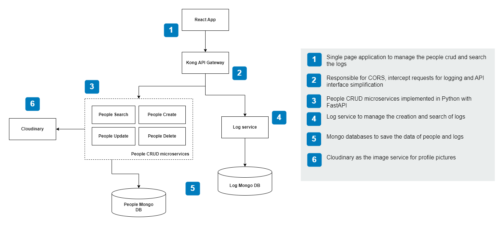

# People Service - Microservices

Backend for the final project of the software design course. An API to manage people with the following main features:

- Each transaction must be stored in a logging service.
- Each CRUD operation must run in a different container

## How to run

Before running the project, create the necessary .env files located in `container_files/env-vars` folder. Use the .example files as a template.

To run the project, execute the following command:

```bash
docker-compose up
```

## Considerations

- The project is not production ready. For example the kong proxy allow any origin to make requests.
- The project is not fully tested, just what is described in the main requirements.

## Improvements

- Add unit, integration and e2e testing.
- Improve configuration of the api gateway.
- Create an OpenAPI schema using the auto generated docs of FastAPI
- Create a simple script to inject environment variables In the declarative configuration of Kong

## Simple component diagram


